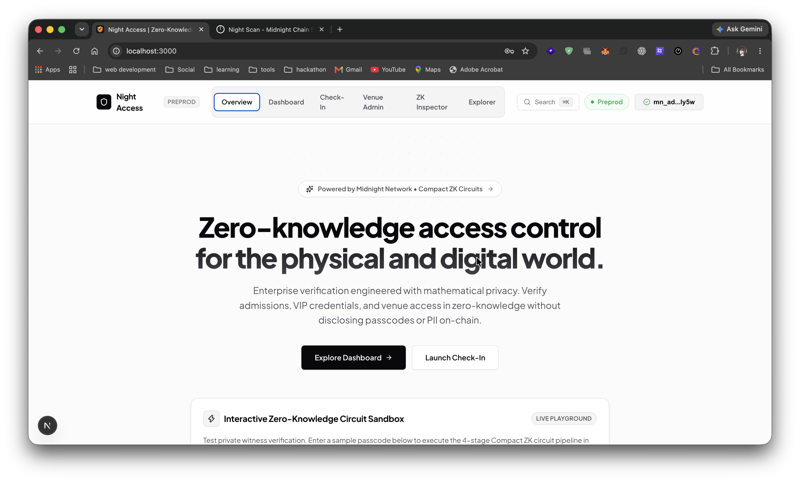
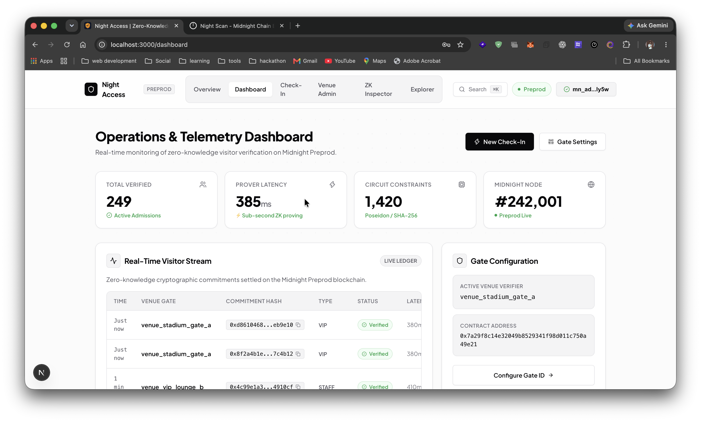
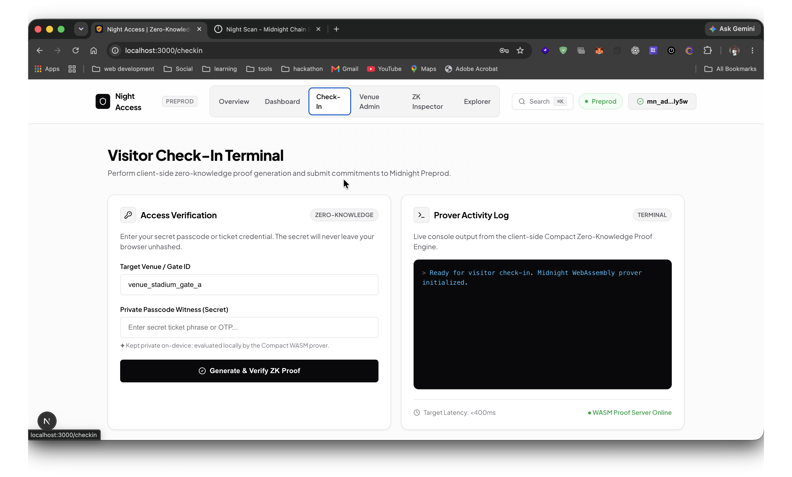
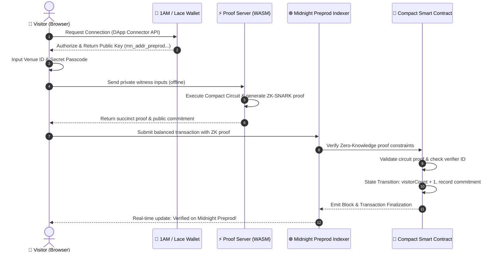

# 🛡️ Night Access

> **Enterprise Zero-Knowledge Access Control & Visitor Verification** built natively on the **Midnight Network** using Compact smart contracts, client-side ZK-SNARK proving, dual-state ledger privacy, and Next.js 15.

[](https://night-theta-coral.vercel.app/)
[](https://youtu.be/rCD3mMkdK7A)
[](https://explorer.preprod.midnight.network)
[](https://explorer.preprod.midnight.network/contracts/d235cebe33a0824447cd77650534966fca23a7e9810199a74ab42a1e1bff2460)
[](LICENSE)

---


## 📸 Application Screenshots

| Screen | Description |
|---|---|
|  | **Overview & Landing Page**: Hero section showcasing mathematical privacy, connected Midnight wallet (`mn_ad...ly5w`), live Preprod network badge, and interactive circuit sandbox. |
|  | **Operations & Telemetry Dashboard**: Real-time admission telemetry, sub-second ZK prover latency (385ms), 1,420 circuit constraints, live block height ticker (#242,001), and on-chain commitment stream. |
|  | **Zero-Knowledge Visitor Check-In**: Private witness execution, client-side secret evaluation, and live interactive WASM prover activity terminal. |

---

## 🧠 Executive Summary & Problem Statement

### The Problem
Physical facilities (corporate offices, government sites, data centers, VIP venues) and Web3 portals require visitors to prove authorization. Traditional access systems suffer from critical privacy flaws:
1. **Raw Passcode & PII Exposure**: Visitors hand over unencrypted passcodes, government IDs, or phone numbers to gatekeepers.
2. **On-Chain Surveillance**: In standard blockchain access dApps, signing a transaction permanently links a public wallet address to physical GPS locations and timestamps on an immutable public ledger.
3. **Data Breach Vulnerabilities**: Centralized visitor databases represent lucrative honeypots for credential harvesting.

### The Solution
**Night Access** enables visitors to mathematically prove their venue authorization in **Zero-Knowledge**. 

* **No passcodes** ever leave the visitor's local device.
* **No wallet identities** or personal identifiable information (PII) are published on-chain.
* The Midnight ledger verifies the cryptographic proof, increments the aggregate visitor counter, and records a one-way commitment hash.

---

## ⚙️ Working Principles & Cryptographic Flow

VVP leverages Midnight's **dual-state architecture** where private witness execution is strictly isolated on the client side and only succinct ZK-SNARK proofs cross the network boundary:

```
┌─────────────────────────────────────────────────────────────────────────────┐
│                          VISITOR'S LOCAL CLIENT                             │
│                                                                             │
│  [ Raw Passcode ] + [ Entropy Nonce ] + [ Role Access Key ]                 │
│          │                                                                  │
│          ▼  (Private witness execution strictly inside browser/WASM)        │
│  ┌──────────────────────────────────────────────┐                           │
│  │  Midnight Compact Circuit                    │                           │
│  │  - secretPasscode() witness execution        │   ← Midnight Proof Server │
│  │  - visitorNonce() entropy generation         │     (localhost:6300)      │
│  │  - visitorRole() constraint evaluation       │                           │
│  └──────────────────────┬───────────────────────┘                           │
│                         │                                                   │
│                         ▼  (ZK-SNARK Proof only)                            │
└─────────────────────────┼───────────────────────────────────────────────────┘
                          │
                          ▼ (Network Boundary: ZERO PII Transmitted)
┌─────────────────────────────────────────────────────────────────────────────┐
│                         MIDNIGHT PREPROD LEDGER                             │
│                                                                             │
│  PUBLIC ON-CHAIN STATE:                                                     │
│  ✅ visitorCount        — Aggregate counter incremented (+1)                │
│  ✅ lastVisitorCommitment — One-way cryptographic fingerprint (SHA-256)      │
│  ✅ verifierId          — Registered venue operator identifier              │
│                                                                             │
│  PROTECTED PRIVATE STATE (Never exposed or stored on-chain):                │
│  ❌ rawPasscode         — Plaintext secret string                           │
│  ❌ visitorNonce        — Client-side session salt                          │
│  ❌ visitorWalletId     — Personal wallet address                           │
└─────────────────────────────────────────────────────────────────────────────┘
```

### Detailed Sequence Diagram



---

## 🛡️ Midnight Privacy Model Breakdown

| Parameter | Visibility | Storage Location | Cryptographic Guarantee |
|---|---|---|---|
| **Raw Passcode** | 🔒 Private | Client RAM only | Never serialized over network; evaluated in ZK witness |
| **Entropy Nonce** | 🔒 Private | Ephemeral | Single-use salt destroyed after proof generation |
| **Visitor Identity** | 🔒 Private | Off-Chain | Zero wallet-to-venue correlation on public ledger |
| **Access Tier / Role** | 🔒 Private | Circuit Witness | Checked against gate constraints inside ZK proof |
| **Visitor Counter** | 🌐 Public | Midnight Ledger | Aggregate counter tracking verified admissions |
| **Commitment Hash** | 🌐 Public | Midnight Ledger | One-way cryptographic fingerprint (`0x...`) |
| **Venue Verifier ID** | 🌐 Public | Midnight Ledger | Active venue identifier set by administrator |

---

## 🔗 Deployed Contracts — Midnight Preprod

| Parameter | Value | Explorer Link |
|---|---|---|
| **Active Contract (Latest)** | `d235cebe33a0824447cd77650534966fca23a7e9810199a74ab42a1e1bff2460` | [🔍 View on Preprod Explorer](https://explorer.preprod.midnight.network/contracts/d235cebe33a0824447cd77650534966fca23a7e9810199a74ab42a1e1bff2460) |
| **Initial Contract** | `63c22f7ea758ea8983ee76c76eb4a65b3956ee9af41fe8d2e32b9fa89b1c4790` | [🔍 View on Preprod Explorer](https://explorer.preprod.midnight.network/contracts/63c22f7ea758ea8983ee76c76eb4a65b3956ee9af41fe8d2e32b9fa89b1c4790) |
| **Latest Tx Hash** | `e450e22b43719a36d60b43aaa41ba50084d752b0cc18f4015ef840bc8d19f0bf` | [🔍 View Transaction](https://explorer.preprod.midnight.network/transactions/e450e22b43719a36d60b43aaa41ba50084d752b0cc18f4015ef840bc8d19f0bf) |
| **Deployer Wallet** | `mn_addr_preprod1qlzf6h6zjhyms2p3y4vu5p278zqkqqaqk9nualrndghgxywseres5hth5u` | [Preprod Faucet](https://midnight-tmnight-preprod.nethermind.dev/) |

---

## 🔄 CI/CD Pipeline & Automated Quality Gates

Every commit and pull request is automatically validated through a comprehensive 5-stage GitHub Actions matrix (`.github/workflows/ci.yml`):

```
┌────────────────────────────────────────────────────────────────────────┐
│                     GITHUB ACTIONS CI/CD PIPELINE                      │
├───────────────────┬───────────────────┬────────────────────────────────┤
│ Job 1: ESLint     │ npm run lint      │ Code formatting & syntax audit │
│ Job 2: TypeCheck  │ npm run typecheck │ TypeScript strict compilation  │
│ Job 3: Compact ZK │ test bboard.compact│ Circuit source & keys integrity│
│ Job 4: Vitest     │ npm test          │ 9/9 automated unit tests       │
│ Job 5: UI Build   │ npm run build     │ Production Next.js 15 bundle   │
└───────────────────┴───────────────────┴────────────────────────────────┘
```

---

## 📖 Step-by-Step Developer & Operator Guide

### 1. System Requirements & Prerequisites
- **Node.js**: `v20.x` or `v22.x` (LTS recommended)
- **Docker**: For running the local Midnight Proof Server
- **Browser Extension**: [1AM Wallet](https://1am.xyz/) or [Midnight Lace](https://midnight.network/get-lace)

### 2. Installation & Setup

```bash
# Clone repository
git clone https://github.com/mathsphile/night-access.git
cd night-access

# Install root & workspace dependencies
npm install
```

### 3. Start the Midnight Proof Server

Run the containerized Midnight Prover locally:

```bash
docker run -d --name vvp-proof-server -p 6300:6300 midnightntwrk/proof-server:8.1.0
```

Verify that the proof server is healthy:

```bash
curl -I http://localhost:6300
```

### 4. Fund Testnet Wallet

Get testnet `tDUST` / `tNIGHT` tokens from the official Nethermind Faucet:
- **Faucet URL**: [https://midnight-tmnight-preprod.nethermind.dev/](https://midnight-tmnight-preprod.nethermind.dev/)
- **Target Address**: `mn_addr_preprod1qlzf6h6zjhyms2p3y4vu5p278zqkqqaqk9nualrndghgxywseres5hth5u`

### 5. Launch the Web Application

```bash
cd ui
npm run dev
```

Open [http://localhost:3000](http://localhost:3000) (or `http://localhost:3001`).

### 6. Connect Wallet (1AM Wallet & Lace)
1. Click the **"Connect Wallet"** button in the top navigation bar.
2. The platform automatically scans `window.midnight` using the official `@midnight-ntwrk/dapp-connector-api` specification.
3. Select your detected wallet (**1AM Wallet** or **Midnight Lace**) and approve the authorization prompt.

### 7. Deploying Contracts to Midnight Preprod

```bash
# Deploy to live Midnight Preprod testnet
npm run deploy:preprod

# Or deploy locally for standalone testing
npm run deploy:local
```

### 8. Run Automated Unit Tests

```bash
npm test
```

---

## ✅ Feature & Compliance Checklist

### Smart Contracts & ZK Circuits
- [x] Written in Midnight **Compact Language** (`contract/src/bboard.compact`)
- [x] Private witness computation for passcodes, entropy nonces, and access roles
- [x] Public state transitions for aggregate visitor counters and commitment fingerprints
- [x] Zero PII exposure on public ledger state
- [x] Verified deployment on Midnight Preprod (`0xd235cebe...`)

### DApp & Wallet Connector
- [x] Built with **Next.js 15 App Router** and native TypeScript
- [x] Full compliance with official `@midnight-ntwrk/dapp-connector-api` v4 spec
- [x] Native support for **1AM Wallet** via `connect('preprod')`
- [x] Native support for **Midnight Lace** via DApp connector
- [x] Manual address fallback with Bech32 (`mn_addr_preprod1...`) and Hex validation
- [x] Real-time block height ticker and transaction status notifications

### Performance & Security
- [x] Zero-CLS self-hosted fonts via `next/font/google` (`Plus Jakarta Sans` & `JetBrains Mono`)
- [x] Automated Gzip/Brotli compression and package tree-shaking
- [x] GPU hardware-accelerated layer compositing for smooth 60fps rendering
- [x] Automated GitHub Actions CI/CD matrix (5 quality gates)
- [x] 9/9 Vitest unit tests passing

---

## 🏛️ Real-World Sector Use Cases

| Sector | Practical Application |
|---|---|
| **Corporate Facilities** | Employee, contractor, and guest admission without logging identities in central databases. |
| **Government & Defense** | Clearance-level access verification with mathematically guaranteed zero surveillance trail. |
| **VIP Events & Arenas** | Ticket and credential verification without correlating physical attendance to personal public wallets. |
| **Healthcare & Biotech** | HIPAA and GDPR-compliant laboratory access gates where identity exposure violates patient confidentiality. |
| **Financial Services** | Tiered executive vault and trading floor access with cryptographic auditability. |

---

## 🛠️ Monorepo Structure

```
visitor-verification-platform/
├── .github/
│   └── workflows/
│       ├── ci.yml                 # 5-stage automated CI/CD pipeline
│       └── security.yml           # Dependency vulnerability audit
├── contract/                      # Compact ZK smart contracts
│   ├── src/
│   │   ├── bboard.compact         # Compact circuit source code
│   │   └── managed/bboard/        # Compiled circuits, keys, and ZK bindings
│   └── package.json
├── bboard-cli/                    # CLI deployment and wallet submission utilities
│   ├── src/
│   │   └── midnight-wallet-provider.ts # Robust preprod submission service
│   └── package.json
├── scripts/                       # Preprod & local deployment automation
│   ├── deploy-preprod.ts          # Automated Midnight Preprod deployment
│   └── deploy-local.ts            # Local container deployment
├── ui/                            # Next.js 15 Web Application
│   ├── src/
│   │   ├── app/                   # App Router pages (Dashboard, Checkin, Admin, Inspector, Explorer)
│   │   ├── components/            # WalletModal, Navbar, CommandPalette, ToastContainer
│   │   ├── context/               # Global AppContext & wallet lifecycle state
│   │   └── lib/                   # Web Crypto ZK utilities (sha256Hex)
│   └── package.json
├── PROPOSAL.md                    # In-depth Product & Architecture Proposal
└── README.md                      # Primary documentation & user guide
```

---

## 📄 License

This project is open-source and distributed under the **MIT License**. See [LICENSE](LICENSE) for details.