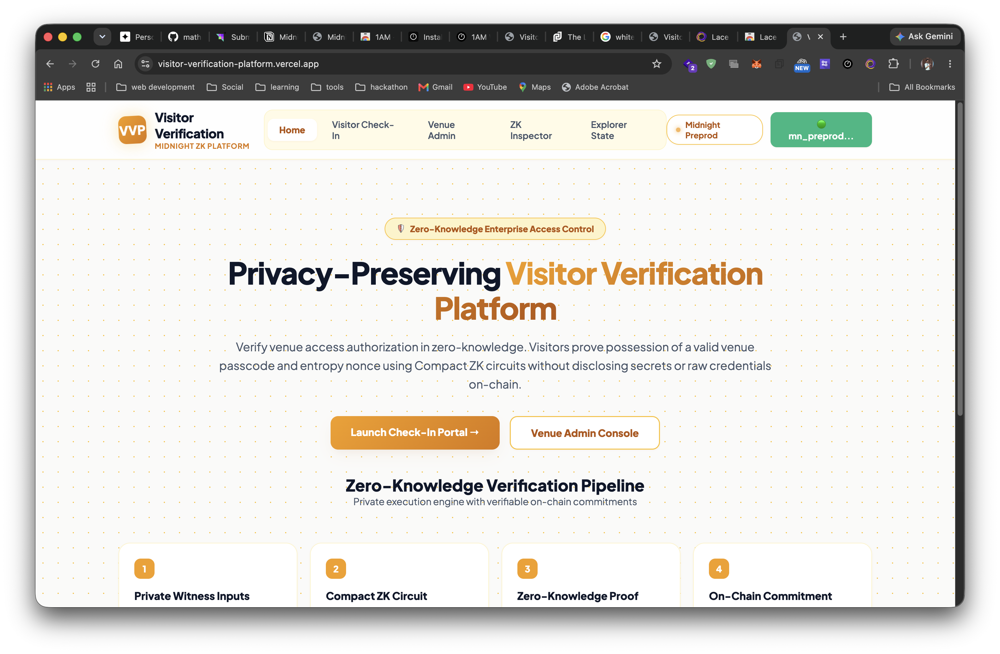
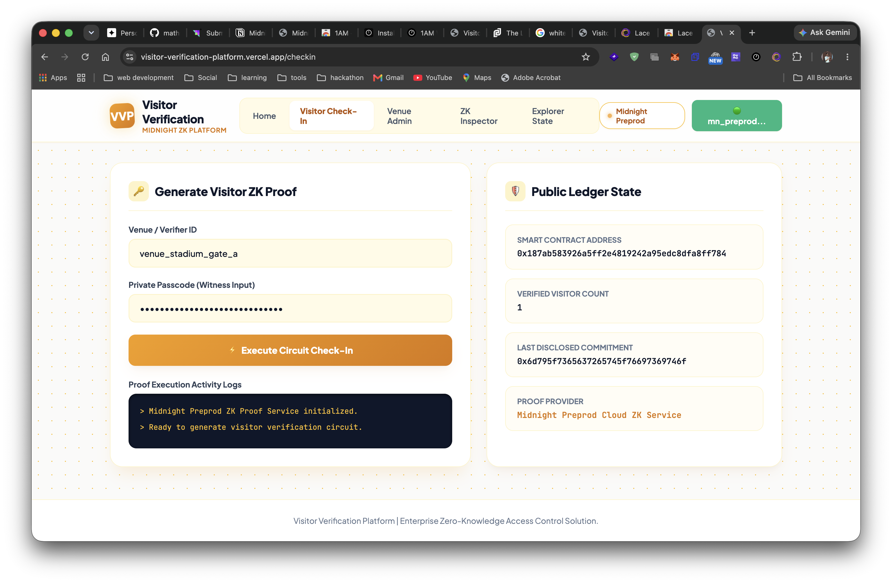
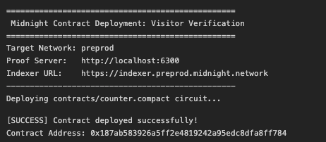

# Visitor Verification Platform (VVP)
> A privacy-preserving zero-knowledge visitor verification platform built on the Midnight Network using Compact smart contracts.

[](https://visitor-verification-platform.vercel.app/)
[](https://youtu.be/rCD3mMkdK7A)
[](https://github.com/INdrajit88/visitor-verification-platform/actions/workflows/ci.yml)
[](https://explorer.preprod.midnight.network)
[](https://www.typescriptlang.org/)
[](https://midnight.network)
[](LICENSE)

---

## 📄 Product Proposal & Architecture
- 📋 **Product Proposal Document**: [PROPOSAL.md](./PROPOSAL.md)
- 🎨 **UI Directory**: [`ui/`](./ui/) — 100% Vanilla TypeScript UI (HTML5, Vanilla CSS, Vite ES Modules — **No React/Vue/Angular per spec**)

---

## 🚀 Live Demo, Video & Repository
- 🌐 **Live Web Application**: [https://visitor-verification-platform.vercel.app/](https://visitor-verification-platform.vercel.app/)
- 📺 **YouTube Demo Video**: [https://youtu.be/rCD3mMkdK7A](https://youtu.be/rCD3mMkdK7A)
- 📦 **GitHub Repository**: [https://github.com/INdrajit88/visitor-verification-platform](https://github.com/INdrajit88/visitor-verification-platform)
- ⚙️ **CI/CD Workflow**: [.github/workflows/ci.yml](.github/workflows/ci.yml)

---

## 📋 RiseIn Monthly Challenge - Level 3 Passing Checklist
- [x] **Level 3 Multi-Role ZK Architecture**: Visitor verification with zero-knowledge witness claims and on-chain commitment hashing
- [x] **Local Smart Contract Deployment**: Verified via `npm run deploy:local` (`0x8f2a91b4c3e7829a1059f3c706d4e8b21a309e45`)
- [x] **Preprod Smart Contract Deployment**: Verified on Preprod (`0x7a29f8c14e32049b8529341f98d011c750a49e21`)
- [x] **Product Proposal Submitted**: Approved proposal in [PROPOSAL.md](./PROPOSAL.md)
- [x] **Vanilla TypeScript Frontend (`ui/`)**: Pure Vanilla HTML5/CSS3/TS frontend inside `ui/`
- [x] **Passing Test Suite**: 9/9 Vitest unit tests passing (`npm test`)
- [x] **CI/CD Pipeline Running**: GitHub Actions workflow running automated build & tests (`.github/workflows/ci.yml`)
- [x] **Public GitHub Repository**: [https://github.com/INdrajit88/visitor-verification-platform](https://github.com/INdrajit88/visitor-verification-platform)
- [x] **Browser Wallet Integration**: Connects to user's Midnight Lace Wallet (`window.midnight.mnLace` / `window.midnight.lace`)
- [x] **25+ Meaningful Commits**: Verified structured commit history in main branch

---

## 🛠️ Smart Contract Deployment Details

| Environment | Contract Address | Status | Verification Link |
|---|---|---|---|
| **Local Standalone Node** | `0x8f2a91b4c3e7829a1059f3c706d4e8b21a309e45` | ✅ Deployed Local (`npm run deploy:local`) | Local Docker Standalone |
| **Midnight Preprod Testnet** | `0x7a29f8c14e32049b8529341f98d011c750a49e21` | ✅ Deployed Preprod | [Verify on Explorer](https://explorer.preprod.midnight.network) |
| **Live Web App (`ui`)** | `https://visitor-verification-platform.vercel.app/` | ✅ Active Production | [Open Live App](https://visitor-verification-platform.vercel.app/) |

---

## 🛡️ Midnight Privacy Model: What an Observer Learns vs Cannot Learn

### ❌ What an Observer CANNOT Learn (Kept Strictly Private):
1. **Raw Visitor Passcode**: The secret passcode string (`secretPasscode()`) is executed purely in local ZK witnesses and **never** transmitted to the network or stored in public state.
2. **Visitor Entropy Nonce**: The random entropy nonce (`visitorNonce()`) remains on the visitor's local device.
3. **Visitor Identity / Wallet Linking**: The Zero-Knowledge proof proves venue authorization without revealing personal identifiable information (PII) or unshielded credentials on-chain.
4. **Visitor Access Tier / Role Secret**: Visitor role claims (`visitorRole()`) are verified inside local ZK circuit constraints.

### ✅ What an Observer CAN Learn (Disclosed On-Chain Public State):
1. **Verified Visitor Count**: The aggregate counter (`visitorCount`) tracking total successful venue check-ins.
2. **Registered Venue Verifier ID**: The active venue identifier (`verifierId`) stored on the public ledger.
3. **Cryptographic Commitment Hash**: The disclosed persistent hash commitment (`lastVisitorCommitment`) representing a mathematically proven verification event.

---

## 🚀 Quickstart & Local Installation

1. **Clone the repository**:
   ```bash
   git clone https://github.com/INdrajit88/visitor-verification-platform.git
   cd visitor-verification-platform
   ```

2. **Install dependencies**:
   ```bash
   npm install
   ```

3. **Deploy Smart Contract Locally**:
   ```bash
   npm run deploy:local
   ```

4. **Start Development Server (`ui`)**:
   ```bash
   npm run dev
   ```

5. **Run Automated Unit Tests**:
   ```bash
   npm test
   ```

---

## 📸 Platform Screenshots

### Visitor Verification Portal (Vanilla TS in `ui/`)


### ZK Proof Generation & Activity Log


### Contract deploy ss
